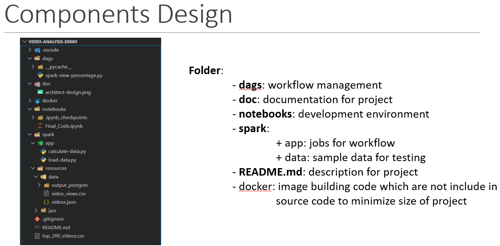
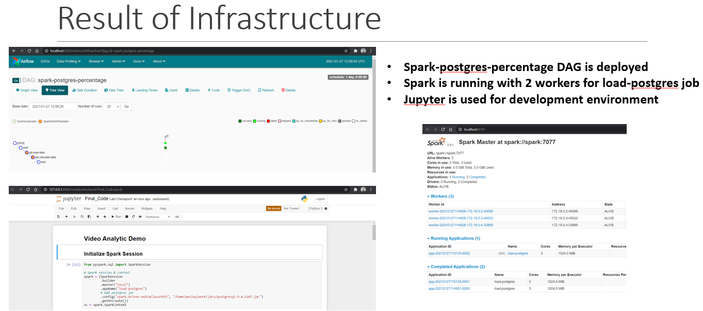

In this work, user want to have understand behaviour of user went they integrate with application. Application export big data with stream data.

Building stream application to ingress and egress data of both user and application data.

## Technical consideration

- postgres: stores Airflow metadata and Testing data.
- airflow-webserver: Airflow webserver and Scheduler.
- spark: Spark Master.
- spark-worker-N: Spark workers.
- jupyter-spark: has pyspark for interactive development.

## Architecture components


## Source Tree



## Setup image which are not include in project OR you can clone from Docker Hub

- Pull required images
- Start containers
  

## Start project

- Making sure you build docker image of airflow and spark.
- Run docker container by command line below:
> cd docker
> docker-compose up -d

Consider to use the service you have to!!!

## Output

```bash
❯ docker ps
CONTAINER ID   IMAGE                                  COMMAND                  CREATED          STATUS                            PORTS                                                                                                                             NAMES
5cbded5d7b5f   puckel/docker-airflow:1.10.9           "/entrypoint.sh webs…"   11 seconds ago   Up 8 seconds (health: starting)   0.0.0.0:5555->5555/tcp, :::5555->5555/tcp, 0.0.0.0:8080->8080/tcp, :::8080->8080/tcp, 0.0.0.0:8793->8793/tcp, :::8793->8793/tcp   docker-airflow-webserver-1
83477e9e96ef   bitnami/spark:3.1.2                    "/opt/bitnami/script…"   12 seconds ago   Up 10 seconds                     0.0.0.0:7077->7077/tcp, :::7077->7077/tcp, 0.0.0.0:8181->8080/tcp, :::8181->8080/tcp                                              docker-spark-1
4132f8280bd6   jupyter/pyspark-notebook:spark-3.1.2   "tini -g -- start-no…"   12 seconds ago   Up 10 seconds                     0.0.0.0:4040-4080->4040-4080/tcp, :::4040-4080->4040-4080/tcp, 0.0.0.0:8888->8888/tcp, :::8888->8888/tcp                          docker-jupyter-spark-1
d728e10de98a   bitnami/spark:3.1.2                    "/opt/bitnami/script…"   12 seconds ago   Up 10 seconds                                                                                                                                                       docker-spark-worker-1-1
41a95705234d   postgres:9.6                           "docker-entrypoint.s…"   12 seconds ago   Up 10 seconds                     0.0.0.0:5432->5432/tcp, :::5432->5432/tcp                                                                                         docker-postgres-1
f299fe67b67f   bitnami/spark:3.0.1                    "/opt/bitnami/script…"   12 seconds ago   Up 10 seconds                                                                                                                                                       docker-spark-worker-2-1

```

## Check if you can access

- Airflow: <http://localhost:8080> , set default_spark
- Connection in Airflow to spark://spark and port 7077
- Spark Master: <http://localhost:8181>
- PostgreSql - Database Test:
  - Server: localhost:5432
  - Database: test
  - User: test
  - Password: postgres

- Postgres - Database airflow:
  - Server: localhost:5432
  - Database: airflow
  - User: airflow
  - Password: airflow

Notes: Access jupyter-spark via "inspect container with CLI below"
$ docker logs -f docker_jupyter-spark_1

## Dry run Spark job

```bash
spark-submit \
    --master spark://spark:7077 \
    --deploy-mode client \
    --num-executors 2 \
    --executor-cores 1 \
    --executor-memory 1024M \
    test_workers.py
```

or

```bash
spark-submit \
    --master spark://spark:7077 \
    --deploy-mode client \
    --num-executors 2 \
    --executor-cores 1 \
    --executor-memory 1024M \
    production_load_test.py
```

```note
Note: You should see workers connected to master
4/12/27 15:22:26 INFO StandaloneAppClient$ClientEndpoint: Executor added: app-20241227152226-0002/0 on worker-20241227144435...  thì okay nha
```

## Documentation

You can use a full of my presentation in doc folder
