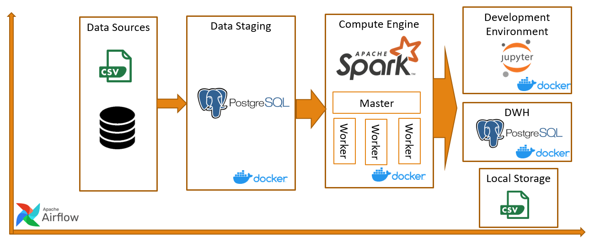

# Video Analysis Demo

This project contains the following containers:

* postgres: stores Airflow metadata and Testing data.
* airflow-webserver: Airflow webserver and Scheduler.
* spark: Spark Master.
* spark-worker-N: Spark workers.
* jupyter-spark: has pyspark for interactive development.

## Architecture components

## Setup image which are not include in project OR you can clone from Docker Hub
* Build Airflow Docker
* Build Jupyter docker
* Start containers

## Start project
    $ docker-compose up -d

## Check if you can access
Airflow: http://localhost:8282
Spark Master: http://localhost:8181
PostgreSql - Database Test:
* Server: localhost:5432
* Database: test
* User: test
* Password: postgres

Postgres - Database airflow:
* Server: localhost:5432
* Database: airflow
* User: airflow
* Password: airflow

Notes: Access jupyter-spark via "inspect container with CLI below"
    $ docker logs -f docker_jupyter-spark_1